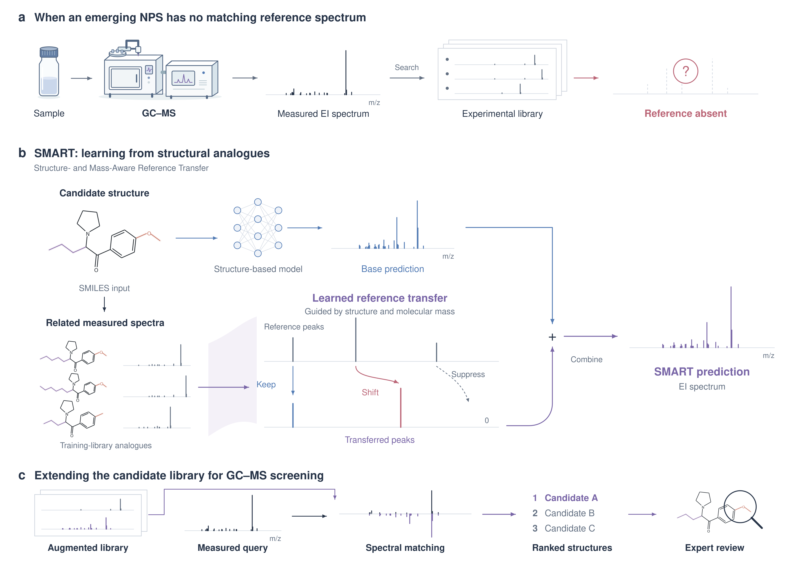

# SMART

**Structure- and Mass-Aware EI Mass Spectrum Prediction for New Psychoactive Substance Screening**

SMART predicts electron ionization (EI) mass spectra for candidate screening in GC–MS. It combines a structure-based prediction with measured spectra from related training molecules. A learned transfer module determines which reference peaks to retain, shift by the molecular mass difference, or suppress.



The final prediction combines 75% base prediction and 25% transferred spectrum after intensity normalization. Up to three training analogues are used; candidates without an eligible analogue retain the base prediction.

## Quick start

Use Python 3.10–3.12 with PyTorch installed for your CPU or CUDA environment. Run commands from the repository root.

```bash
pip install -r requirements.txt
python train.py --device cpu --epochs 3
python predict.py --device cpu
python evaluate.py
```

The example runs without downloading MoLFormer weights. It uses 32 measured records and cached base predictions to demonstrate transfer training, prediction, and retrieval. Its split is for execution only; the upstream training identities are unavailable, so these outputs are not independent benchmark results or a reproduction of the paper.

Outputs are written to `outputs/`: `smart/model.pt`, `predictions.npz`, and `evaluation.json`. For another run, choose new paths with `--output` and pass the corresponding `--checkpoint` or `--predictions` path.

## Your data

Follow `data/example.csv`, with columns:

```text
record_id,name,smiles,split,spectrum,electron_energy_ev,source,is_swgdrug
```

Use `train`, `val`, or `test` for the split and `43:100;58:32;91:65` for a spectrum. Molecular connectivity must not overlap across splits. Structures must be neutral, single-component, and isotope-unlabeled. Leave unknown electron energies blank. `is_swgdrug` is a source-coverage flag, used for domain adaptation and subgroup reporting.

Prediction uses 751 integer mass bins covering m/z 0–750. To predict a new structure, add its SMILES as a nontraining row with an empty spectrum, retaining the training reference rows. Measured spectra are required for evaluation.

Full datasets and trained EI checkpoints are not included. Source resources are [MoNA](https://mona.fiehnlab.ucdavis.edu/downloads), [SWGDRUG](https://www.swgdrug.org/ms.htm), and [MoLFormer-XL](https://huggingface.co/ibm-research/MoLFormer-XL-both-10pct). Use the `compat-v4` MoLFormer revision with the pinned Transformers version. Place its configuration, tokenizer, weights, and custom Python modules in `models/molformer/`.

## Training and prediction

```bash
python train.py --model molformer --data data/dataset.csv --device cuda
python train.py --model adapt --data data/dataset.csv --init-from outputs/molformer/model.pt --device cuda
python train.py --model smart --data data/dataset.csv --output outputs/smart_full --device cuda
python predict.py --data data/dataset.csv --base-checkpoint outputs/adapt/model.pt --checkpoint outputs/smart_full/model.pt --output outputs/full_predictions.npz --device cuda
python evaluate.py --data data/dataset.csv --predictions outputs/full_predictions.npz --output outputs/full_evaluation.json
```

Domain adaptation requires SWGDRUG-covered structures in both training and validation. SMART selects the transfer training duration on an internal training partition and then refits on all training structures. This is a compact implementation of the method; reproducing manuscript values requires the original curated data, split, and checkpoints.

An existing base prediction cache can replace `--base-checkpoint` using `--base-predictions`. NPZ caches contain `group_key`, canonical `smiles`, and raw-intensity `spectrum` arrays for every candidate, ordered by the sorted first InChIKey block. Include `upstream_train_keys` when the base model's supervised training identities are known.

Use `train.py --model neims` for the NEIMS reimplementation. Prediction controls are `--method base`, `copy`, and `hybrid`; the learned no-shift control uses `train.py --model reweight` and `predict.py --method reweight`. CFM-EI is an external baseline and is not bundled.

## Code and evaluation

| File | Purpose |
|---|---|
| `models.py` | Structure-based predictors and learned peak transfer |
| `data.py` | CSV loading, molecular identities, and reference preparation |
| `train.py` | Base-model training, adaptation, and transfer training |
| `predict.py` | SMART predictions and ablation controls |
| `evaluate.py` | Spectral similarity and candidate retrieval |
| `config.json` | Model and training settings |

Default retrieval searches every candidate, using fixed measured training spectra and predicted spectra for validation/test candidates. It reports Top-1/5/10, mean reciprocal rank, and spectral cosine, averaged within each structure before averaging across structures. Test spectra are query spectra and are excluded from the reference bank. Predictions retain their split and reference metadata so incompatible evaluation inputs are rejected.
